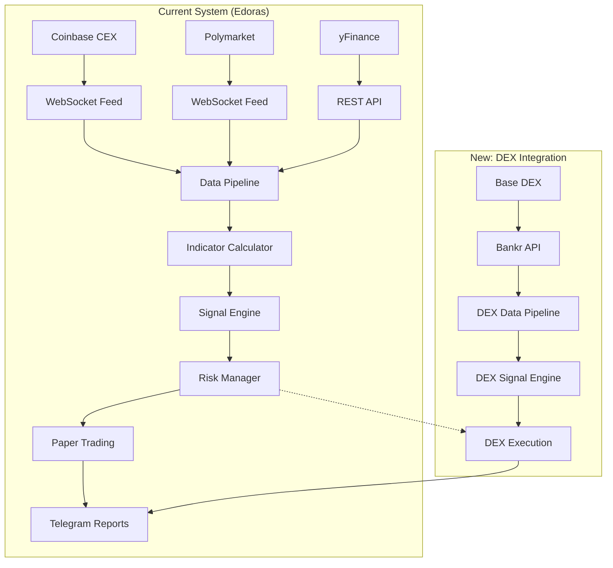
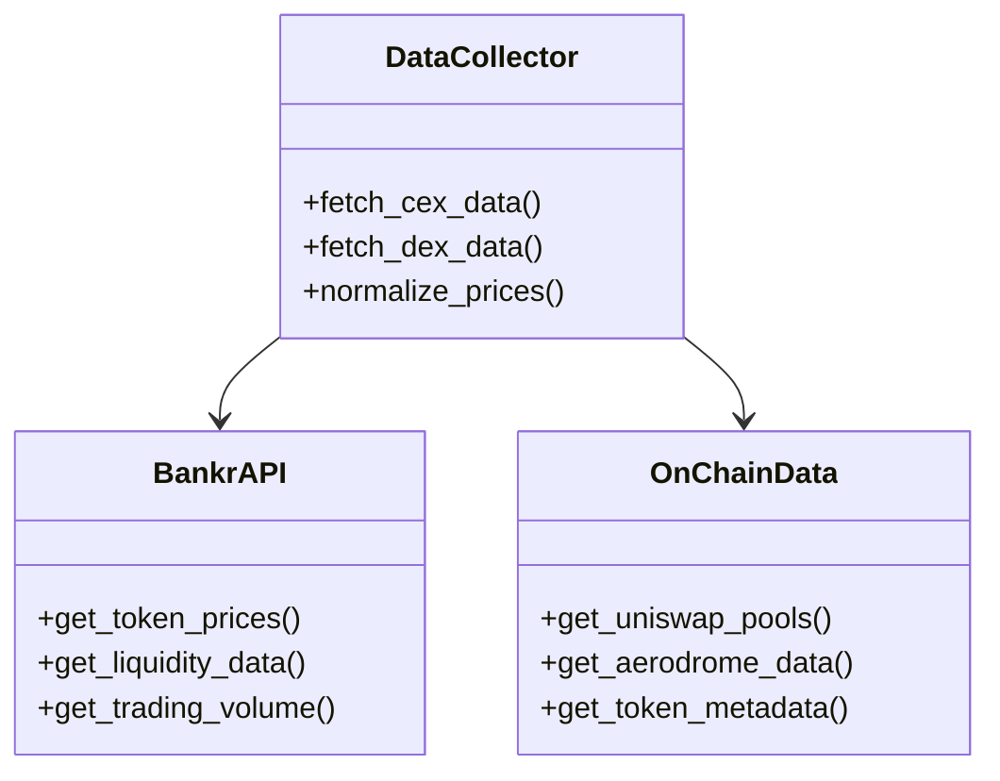
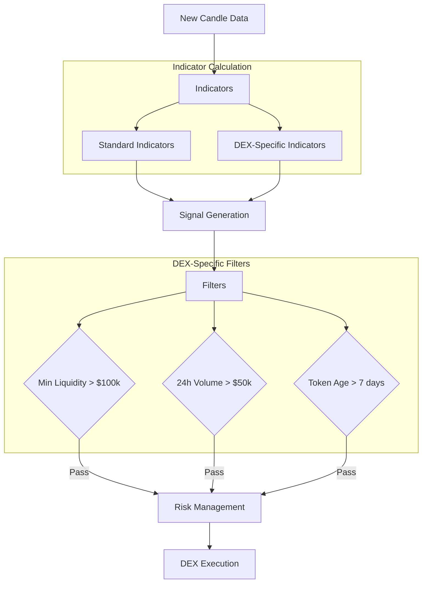
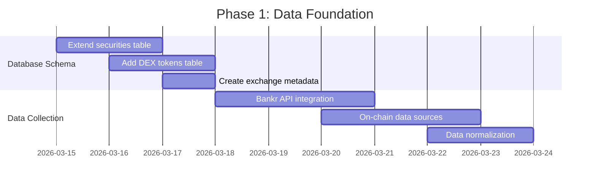
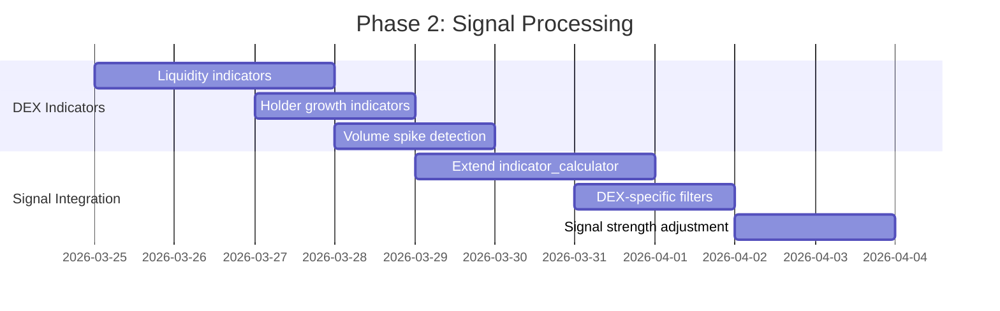
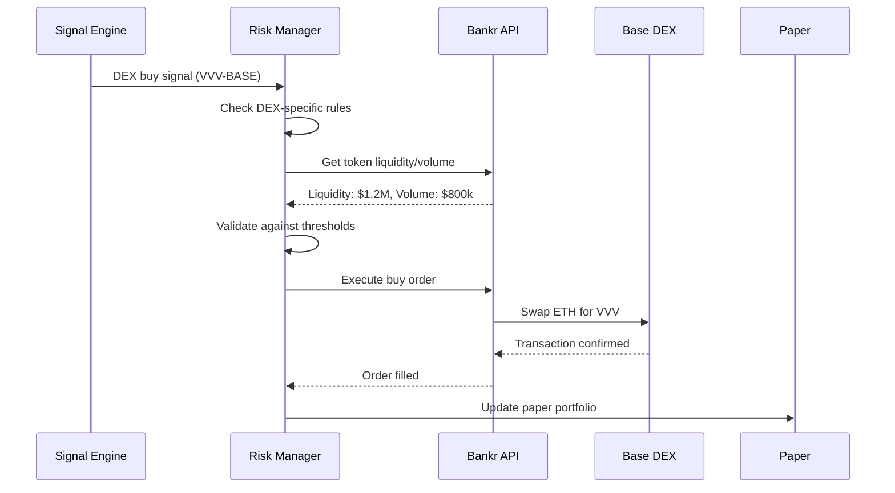
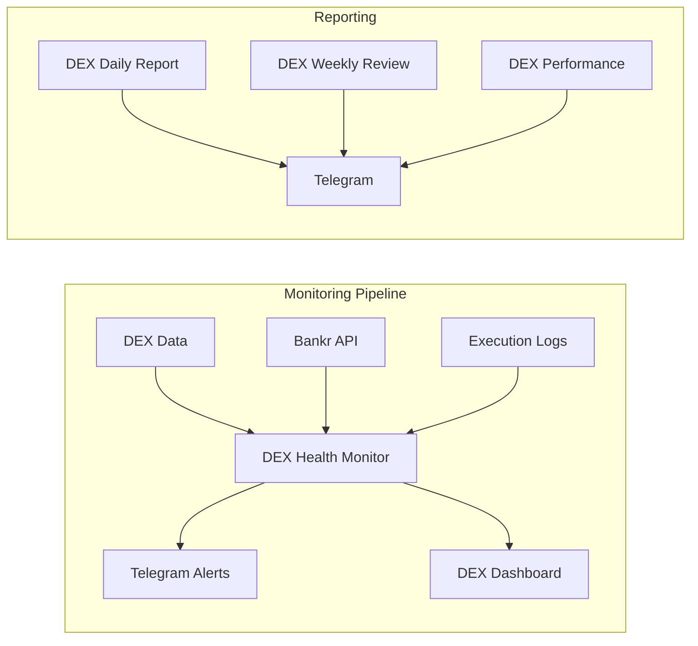

# DEX Integration Architecture for Edoras Trading System

## Overview

Extend the existing multi-asset trading system (`projects/edoras/`) to support Base chain DEX trading via Bankr API. This document outlines the architecture, requirements, and implementation plan for integrating decentralized exchange capabilities.

## Current Architecture (Baseline)



## Integration Requirements

### 1. Data Layer Extension

**Current:** CEX data via Coinbase WebSocket + REST
**New:** DEX data via Bankr API + on-chain data providers



### 2. Security Schema Extension

**Current:** `securities` table supports CEX symbols
**New:** Add DEX token support with chain metadata

```mermaid
erDiagram
    SECURITIES {
        int id PK
        string symbol
        string name
        string type
        string class
        string sector
        string exchange FK
        string indicator_profile
        datetime created_at
    }
    
    EXCHANGES {
        int id PK
        string name
        string type
        string api_endpoint
    }
    
    DEX_TOKENS {
        int id PK
        int security_id FK
        string chain
        string contract_address
        string dex_platform
        decimal liquidity
        int holder_count
        datetime last_updated
    }
    
    SECURITIES ||--o{ DEX_TOKENS : "has DEX instances"
    SECURITIES }o--|| EXCHANGES : "traded on"
    
    SECURITIES {
        "Existing: BTC-USD, ETH-USD, etc."
        "New: VVV-BASE, FAI-BASE, BNKR-BASE"
    }
    
    EXCHANGES {
        "Existing: coinbase, yfinance, polymarket"
        "New: base_dex, ethereum_dex, polygon_dex"
    }
```

### 3. Signal Pipeline Extension

**Current:** CEX-focused signals with risk checks
**New:** DEX-specific signals with liquidity filters



## Implementation Phases

### Phase 1: Data Collection & Schema (Week 1)



**Tasks:**
1. Extend `securities` table with `chain` and `contract_address` fields
2. Create `dex_tokens` table for DEX-specific metadata
3. Add Base, Ethereum, Polygon as DEX exchanges
4. Build `bankr_data_collector.py` module
5. Integrate DeFi Llama/CoinGecko for additional DEX data

### Phase 2: Signal Engine Extension (Week 2)



**Tasks:**
1. Add DEX-specific indicators to `indicator_calculator.py`:
   - Liquidity change (%)
   - Holder count growth
   - Volume-to-liquidity ratio
   - Social sentiment (via Bankr/DEXTools)
2. Create DEX signal filters in `signal_trading.py`
3. Adjust signal strength based on DEX metrics

### Phase 3: Execution & Risk Management (Week 3)



**Tasks:**
1. Extend `risk_manager.py` with DEX-specific rules
2. Build `dex_executor.py` using Bankr API
3. Create slippage protection and gas optimization
4. Integrate with existing paper trading system

### Phase 4: Monitoring & Reporting (Week 4)



**Tasks:**
1. Build DEX health monitoring (`dex_monitor.py`)
2. Create DEX-specific reports
3. Add DEX metrics to existing portfolio reports
4. Build alert system for DEX anomalies

## Technical Specifications

### 1. Bankr API Integration

```python
# Proposed bankr_client.py module
class BankrClient:
    def __init__(self, api_key: str):
        self.api_key = api_key
        self.base_url = "https://api.bankr.bot"
    
    async def get_token_price(self, symbol: str, chain: str) -> float:
        """Get current token price via Bankr"""
        
    async def get_liquidity(self, contract_address: str, chain: str) -> dict:
        """Get token liquidity data"""
        
    async def execute_swap(self, 
                          from_token: str, 
                          to_token: str, 
                          amount: float,
                          chain: str = "base") -> dict:
        """Execute DEX swap via Bankr"""
        
    async def get_portfolio_balance(self, chain: str = None) -> dict:
        """Get wallet balances across chains"""
```

### 2. DEX-Specific Indicators

| Indicator | Formula | Purpose |
|-----------|---------|---------|
| **Liquidity Change %** | `(current_liquidity - prev_liquidity) / prev_liquidity` | Track liquidity inflows/outflows |
| **Holder Growth Rate** | `(current_holders - prev_holders) / prev_holders` | Measure token adoption |
| **Volume/Liquidity Ratio** | `24h_volume / liquidity` | Identify high-velocity tokens |
| **Price Impact** | `slippage_for_1%_trade` | Measure market depth |
| **Social Score** | `bankr_sentiment_analysis()` | Gauge community sentiment |

### 3. Risk Management Rules (DEX-Specific)

```yaml
dex_risk_rules:
  minimum_liquidity: $100,000  # Skip tokens below this
  minimum_volume: $50,000      # 24h volume threshold
  maximum_slippage: 5%         # Cancel if slippage exceeds
  position_size_limit: 10%     # Max of portfolio per DEX token
  token_age_days: 7            # Minimum token age
  holder_count_min: 100        # Minimum unique holders
```

## Pros and Cons Analysis

### Advantages ✅

1. **Diversification**: Access to memecoins, new launches, niche tokens
2. **24/7 Markets**: DEXs never close (vs CEX trading hours)
3. **Lower Fees**: Base chain ~$0.01 vs Coinbase 0.5% trading fees
4. **Direct Ownership**: Tokens in your wallet, not custodial
5. **Early Access**: Get into tokens before CEX listings
6. **Leverage Trading**: Avantis on Base offers up to 50x crypto leverage

### Disadvantages ⚠️

1. **Liquidity Risk**: Thin markets can cause high slippage
2. **Smart Contract Risk**: Vulnerabilities in token contracts
3. **Rug Pull Risk**: Anonymous teams can abandon projects
4. **Data Quality**: Less reliable than CEX data feeds
5. **Execution Complexity**: More steps than CEX market orders
6. **Gas Costs**: While low on Base, still additional complexity
7. **Regulatory Uncertainty**: DEX regulatory landscape evolving

### Mitigation Strategies 🛡️

1. **Liquidity Filters**: Only trade tokens > $100k liquidity
2. **Contract Audits**: Check if token has verified audit (when possible)
3. **Position Sizing**: Small positions (1-5% of portfolio)
4. **Slippage Protection**: Limit orders, maximum slippage thresholds
5. **Multi-Source Data**: Combine Bankr + DeFi Llama + DEXTools
6. **Gradual Rollout**: Start with blue-chip DEX tokens (ETH, USDC on Base)

## Integration Points with Existing System

### 1. Database Schema Updates

```sql
-- Add to securities table
ALTER TABLE securities ADD COLUMN chain TEXT;
ALTER TABLE securities ADD COLUMN contract_address TEXT;
ALTER TABLE securities ADD COLUMN is_dex BOOLEAN DEFAULT FALSE;

-- New dex_tokens table
CREATE TABLE dex_tokens (
    id INTEGER PRIMARY KEY AUTOINCREMENT,
    security_id INTEGER NOT NULL,
    chain TEXT NOT NULL,
    contract_address TEXT NOT NULL UNIQUE,
    dex_platform TEXT,
    liquidity REAL,
    holder_count INTEGER,
    created_at TIMESTAMP,
    last_updated TIMESTAMP,
    FOREIGN KEY (security_id) REFERENCES securities(id)
);

-- New exchanges
INSERT INTO exchanges (name, type, api_endpoint) VALUES
    ('base_dex', 'dex', 'https://api.bankr.bot'),
    ('ethereum_dex', 'dex', 'https://api.bankr.bot'),
    ('polygon_dex', 'dex', 'https://api.bankr.bot');
```

### 2. Configuration Updates

```python
# config.py additions
DEX_CONFIG = {
    'enabled': True,
    'default_chain': 'base',
    'min_liquidity_usd': 100000,
    'min_volume_24h_usd': 50000,
    'max_slippage_percent': 5.0,
    'max_position_size_percent': 10.0,
    'bankr_api_key': os.getenv('BANKR_API_KEY'),
    'supported_chains': ['base', 'ethereum', 'polygon'],
}

# Add to symbols list
DEX_SYMBOLS = [
    {'symbol': 'VVV-BASE', 'name': 'Venice Token', 'chain': 'base', 'contract': '0x...'},
    {'symbol': 'FAI-BASE', 'name': 'FAI', 'chain': 'base', 'contract': '0x...'},
    {'symbol': 'BNKR-BASE', 'name': 'BankrCoin', 'chain': 'base', 'contract': '0x...'},
    {'symbol': 'ETH-BASE', 'name': 'Ethereum', 'chain': 'base', 'contract': '0x...'},
    {'symbol': 'USDC-BASE', 'name': 'USD Coin', 'chain': 'base', 'contract': '0x...'},
]
```

### 3. Signal Pipeline Integration

```python
# signal_trading.py modifications
def generate_dex_signals(symbol, indicators, dex_metadata):
    """Generate signals for DEX tokens with additional filters"""
    
    # Standard signal generation
    base_signal = generate_signal(symbol, indicators)
    
    if not base_signal:
        return None
    
    # Apply DEX-specific filters
    if dex_metadata['liquidity'] < DEX_CONFIG['min_liquidity_usd']:
        return None
        
    if dex_metadata['volume_24h'] < DEX_CONFIG['min_volume_24h_usd']:
        return None
        
    if dex_metadata['holder_count'] < 100:
        return None
    
    # Adjust signal strength based on DEX metrics
    liquidity_score = min(dex_metadata['liquidity'] / 1000000, 1.0)
    volume_score = min(dex_metadata['volume_24h'] / 500000, 1.0)
    
    adjusted_strength = base_signal.strength * (0.7 + 0.3 * liquidity_score)
    
    return DexSignal(
        symbol=base_signal.symbol,
        action=base_signal.action,
        strength=adjusted_strength,
        dex_metadata=dex_metadata
    )
```

## Testing Strategy

### 1. Paper Trading Phase
- **Duration**: 30 days minimum
- **Capital**: Virtual $1,000 DEX portfolio
- **Metrics**: Win rate, Sharpe ratio, max drawdown
- **Comparison**: DEX vs CEX performance under same market conditions

### 2. Small Live Test
- **Duration**: 14 days after successful paper trading
- **Capital**: $100 real ETH (from the operator's gift)
- **Tokens**: Start with high-liquidity tokens only
- **Monitoring**: Daily performance reviews

### 3. Gradual Scaling
- **Phase 1**: 5% of portfolio to DEX
- **Phase 2**: 10% if performance metrics positive
- **Phase 3**: 20% maximum allocation cap

## Success Metrics

| Metric | Target | Measurement |
|--------|---------|-------------|
| **Win Rate** | >55% | Closed trades profitable |
| **Sharpe Ratio** | >1.0 | Risk-adjusted returns |
| **Max Drawdown** | <15% | Peak-to-trough decline |
| **Slippage Cost** | <2% | Average execution cost |
| **Liquidity Filter** | 100% | No trades below $100k liquidity |
| **Automation Rate** | >90% | Signals auto-executed |

## Risks and Contingencies

### High-Risk Scenarios:
1. **Smart contract exploit** → Immediate halt, audit all contracts
2. **Bankr API outage** → Fallback to manual DEX interaction
3. **Liquidity crisis** → Pause trading, increase liquidity thresholds
4. **Regulatory action** → Consult legal, may need to disable certain features

### Circuit Breakers:
- Daily loss limit: 5% of DEX portfolio
- Weekly loss limit: 15% of DEX portfolio
- Single position loss: 25% of position value
- Gas price spike: >100 gwei → pause trading

## Timeline and Resources

### Estimated Timeline: 4-6 weeks
- **Phase 1 (Data)**: 1 week
- **Phase 2 (Signals)**: 1-2 weeks  
- **Phase 3 (Execution)**: 1 week
- **Phase 4 (Monitoring)**: 1 week
- **Testing & Refinement**: 1-2 weeks

### Required Resources:
1. **Bankr API key** with read-write permissions
2. **Additional data sources**: DeFi Llama API, CoinGecko API
3. **Development time