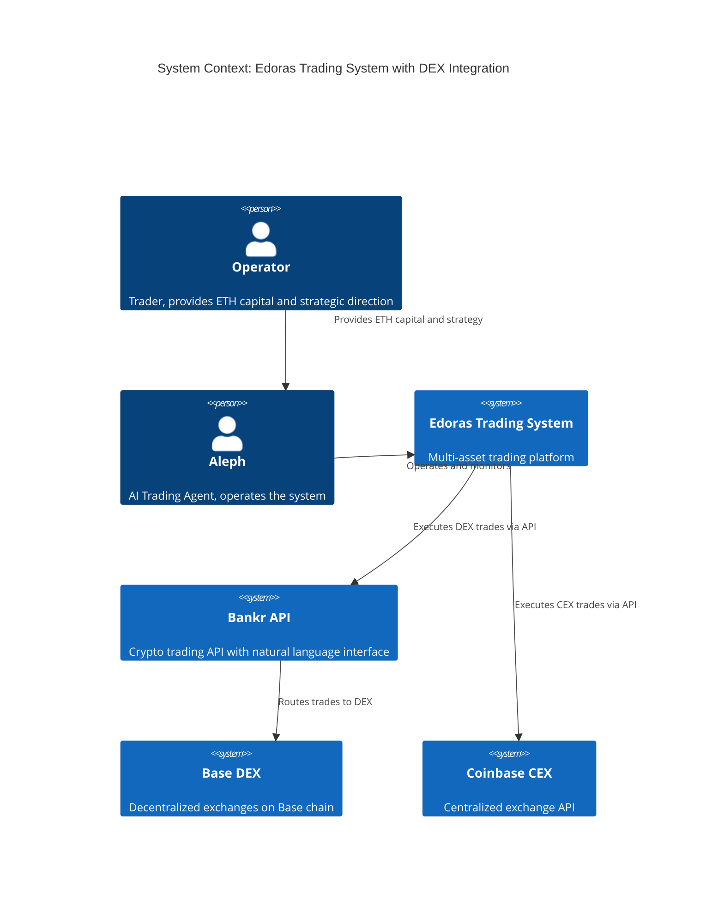
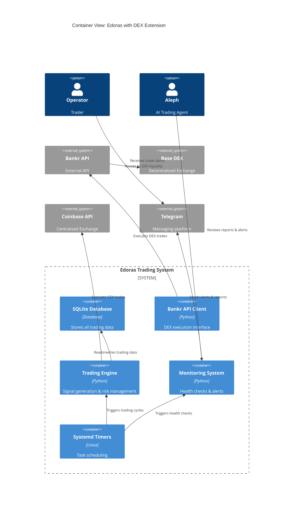
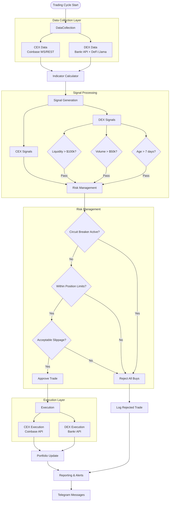
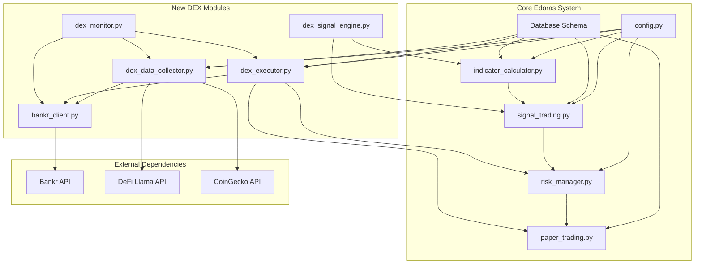
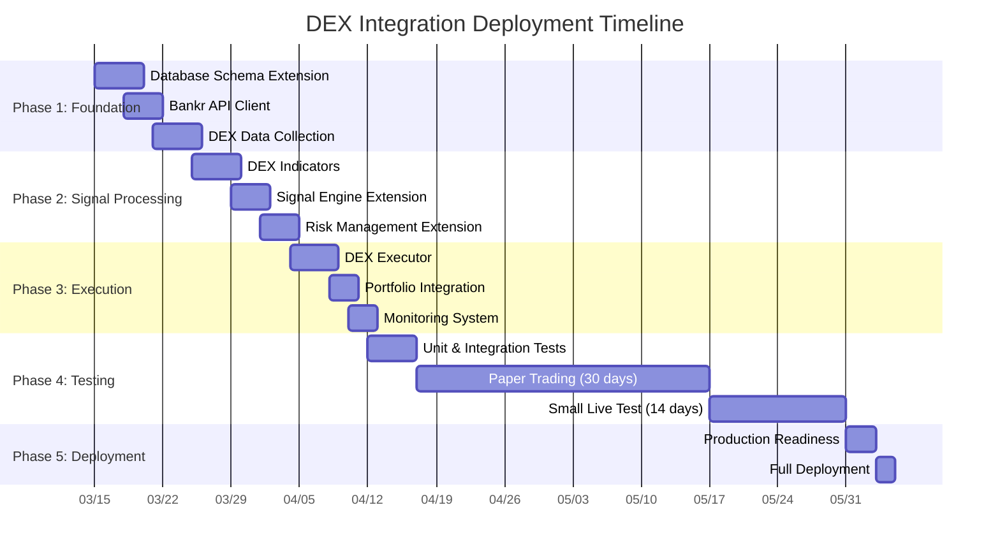
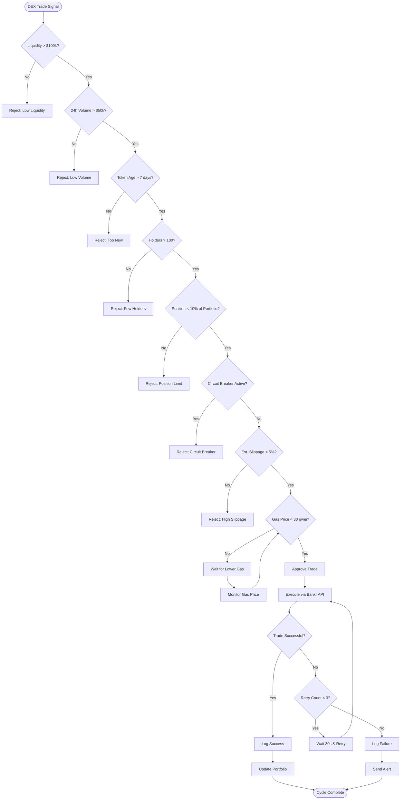
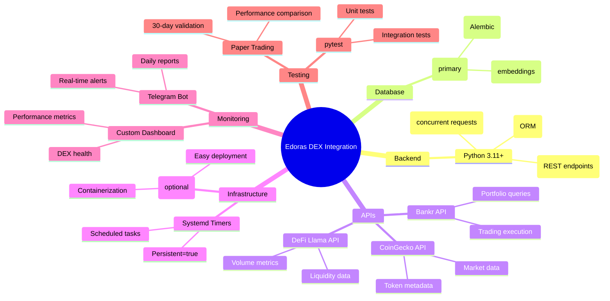

# DEX Integration Architecture Diagram

## System Context Diagram



## Container Diagram



## Component Diagram: DEX Integration

```mermaid
C4Component
    title Component View: DEX Integration Modules
    
    Container(edoras, "Edoras Trading System", "Python") {
        Component(data, "Data Collection", "Collects market data")
        Component(signals, "Signal Engine", "Generates trading signals")
        Component(risk, "Risk Manager", "Manages position risk")
        Component(exec, "Execution Engine", "Executes trades")
        Component(report, "Reporting", "Generates reports")
        
        Component(dex_data, "DEX Data Collector", "Collects DEX-specific data")
        Component(dex_signals, "DEX Signal Engine", "DEX-specific signals")
        Component(dex_exec, "DEX Executor", "Executes via Bankr API")
        Component(dex_monitor, "DEX Monitor", "Monitors DEX health")
    }
    
    ContainerDb(db, "SQLite DB", "Database")
    System_Ext(bankr, "Bankr API", "External API")
    System_Ext(dex_sources, "DEX Data Sources", "DeFi Llama, CoinGecko")
    
    Rel(data, dex_sources, "Fetches DEX market data", "HTTPS")
    Rel(dex_data, db, "Stores DEX metadata", "SQL")
    Rel(signals, dex_signals, "Extends with DEX logic", "Python call")
    Rel(dex_signals, risk, "Sends DEX signals for validation", "Python call")
    Rel(risk, dex_exec, "Approves DEX trades", "Python call")
    Rel(dex_exec, bankr, "Executes trades", "HTTPS/JSON")
    Rel(dex_monitor, report, "Sends DEX alerts", "Python call")
    Rel(dex_exec, db, "Logs DEX transactions", "SQL")
    
    UpdateRelStyle(data, dex_sources, $offsetY="10", $offsetX="80")
    UpdateRelStyle(dex_exec, bankr, $offsetY="-10", $offsetX="60")
```

## Data Flow Diagram



## Database Schema Extension

```mermaid
erDiagram
    SECURITIES {
        int id PK
        string symbol
        string name
        string type
        string class
        string sector
        int exchange_id FK
        string indicator_profile
        string chain
        string contract_address
        boolean is_dex
        datetime created_at
    }
    
    EXCHANGES {
        int id PK
        string name
        string type
        string api_endpoint
    }
    
    DEX_TOKENS {
        int id PK
        int security_id FK
        string chain
        string contract_address UK
        string dex_platform
        float liquidity
        int holder_count
        datetime created_at
        datetime last_updated
    }
    
    DEX_TRANSACTIONS {
        int id PK
        int portfolio_id FK
        int security_id FK
        string tx_hash UK
        string action
        float amount
        float price
        float slippage
        float gas_used
        string status
        datetime created_at
        datetime confirmed_at
    }
    
    PORTFOLIOS {
        int id PK
        string name
        string mode
        float capital
        boolean active
    }
    
    SECURITIES ||--o{ DEX_TOKENS : "has DEX instances"
    SECURITIES }o--|| EXCHANGES : "traded on"
    DEX_TRANSACTIONS }o--|| PORTFOLIOS : "executed in"
    DEX_TRANSACTIONS }o--|| SECURITIES : "traded"
    
    SECURITIES {
        "Examples:"
        "BTC-USD (CEX)"
        "ETH-USD (CEX)" 
        "VVV-BASE (DEX)"
        "FAI-BASE (DEX)"
    }
    
    EXCHANGES {
        "coinbase (CEX)"
        "yfinance (CEX)"
        "polymarket (CEX)"
        "base_dex (DEX)"
        "ethereum_dex (DEX)"
    }
```

## Module Dependency Graph



## Deployment Timeline



## Risk Management Flow



## Monitoring Dashboard View

```mermaid
quadrantChart
    title DEX Token Monitoring Dashboard
    x-axis "Low Liquidity" --> "High Liquidity"
    y-axis "Low Volume" --> "High Volume"
    
    "VVV-BASE": [0.8, 0.9]
    "FAI-BASE": [0.6, 0.7]
    "BNKR-BASE": [0.7, 0.6]
    "ETH-BASE": [1.0, 1.0]
    "USDC-BASE": [1.0, 0.8]
    
    quadrant-1 "Watch: High Risk"
    quadrant-2 "Trade: Good Opportunity"
    quadrant-3 "Avoid: Low Activity"
    quadrant-4 "Hold: Stable"
```

## Technology Stack



## Summary

The DEX integration extends the existing Edoras trading system with:

1. **Data Layer**: New sources (Bankr, DeFi Llama, CoinGecko) for DEX token data
2. **Signal Layer**: DEX-specific indicators and filters (liquidity, volume, age)
3. **Execution Layer**: Bankr API integration for natural language trading
4. **Risk Layer**: Extended risk management with DEX-specific rules
5. **Monitoring Layer**: Comprehensive health checks and alerts

The architecture maintains backward compatibility with existing CEX functionality while adding DEX capabilities through modular extensions. The phased deployment approach minimizes risk and allows for thorough testing at each stage.

**Key Design Principles:**
- **Modularity**: DEX functionality as optional extensions
- **Safety**: Multiple risk filters before execution
- **Observability**: Comprehensive logging and monitoring
- **Maintainability**: Clear separation between CEX and DEX code
- **Scalability**: Support for multiple chains (Base, Ethereum, Polygon)