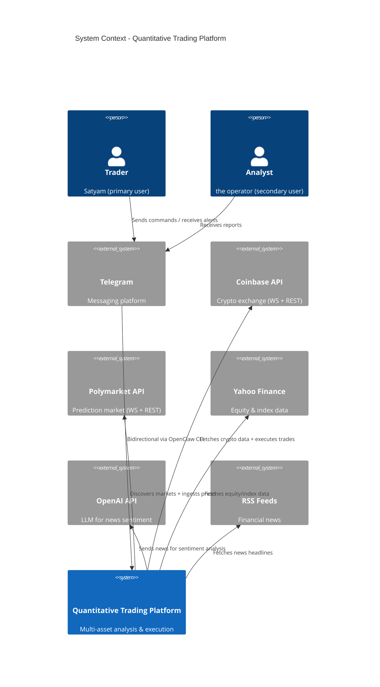
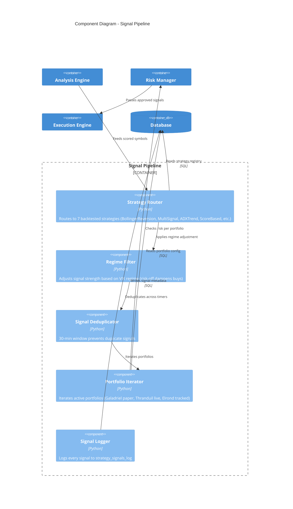
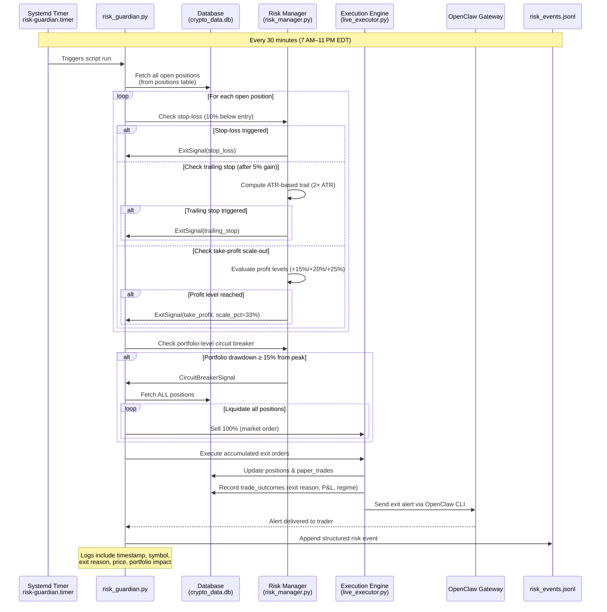

# Quantitative Trading Platform - Architecture Diagrams

> Mermaid C4 diagrams for the multi-asset trading system.

## System Context (C4 Context)

Shows the platform's external users and systems.



## Container Diagram (C4 Container)

Zooms into the platform's internal containers (applications, databases, services).

```mermaid
C4Container
    title Container Diagram - Quantitative Trading Platform

    Person(trader, "Trader")

    Container_Boundary(platform, "Trading Platform") {
        Container(ws_supervisor, "WebSocket Supervisor", "Python", "Manages real-time feeds: Coinbase + Polymarket WebSockets")
        Container(data_collection, "Data Collection Services", "Python + systemd timers", "Scheduled REST collection (crypto, equity, polymarket, RSS)")
        Container(analysis_engine, "Analysis Engine", "Python", "Indicator calculation, scoring, correlation tracking, regime detection")
        Container(signal_pipeline, "Signal Pipeline", "Python", "Strategy routing, risk checks, regime adjustment")
        Container(risk_manager, "Risk Manager", "Python", "Stop-loss, trailing stop, take-profit, circuit breaker, sector limits")
        Container(backtester, "Backtesting Engine", "Python", "Walk‑forward backtesting, 7 strategies")
        Container(execution_engine, "Execution Engine", "Python", "Paper trading, live execution (dry‑run/paper/live modes)")
        Container(reporting, "Reporting Services", "Python + systemd timers", "Portfolio snapshots, news digests, company financials")
        ContainerDb(database, "Database", "SQLite", "crypto_data.db – candlesticks, indicators, positions, trade outcomes, dimension tables")
        Container(queue, "Message Queue", "Systemd timers", "Scheduled job queue (not a separate service)")
    }

    System_Ext(telegram, "Telegram")
    System_Ext(coinbase, "Coinbase API")
    System_Ext(polymarket, "Polymarket API")
    System_Ext(yfinance, "Yahoo Finance")
    System_Ext(openai, "OpenAI API")
    System_Ext(rss, "RSS Feeds")

    Rel(trader, telegram, "Uses")
    Rel(telegram, reporting, "Receives alerts/reports via", "OpenClaw CLI")

    Rel(ws_supervisor, coinbase, "Subscribes to tickers", "WebSocket")
    Rel(ws_supervisor, polymarket, "Subscribes to price_change events", "WebSocket")
    Rel(data_collection, coinbase, "REST gap‑fill", "HTTPS")
    Rel(data_collection, polymarket, "Market discovery + price ingestion", "HTTPS")
    Rel(data_collection, yfinance, "Equity/index data fetch", "HTTPS")
    Rel(data_collection, rss, "News headlines fetch", "HTTPS")
    Rel(analysis_engine, openai, "Sentiment analysis", "HTTPS")

    Rel(ws_supervisor, database, "Writes candlesticks", "SQL")
    Rel(data_collection, database, "Writes candlesticks + metadata", "SQL")
    Rel(analysis_engine, database, "Reads/writes indicators + correlations", "SQL")
    Rel(signal_pipeline, database, "Reads indicators + securities metadata", "SQL")
    Rel(risk_manager, database, "Reads positions + writes exit signals", "SQL")
    Rel(backtester, database, "Reads historical data + writes results", "SQL")
    Rel(execution_engine, database, "Reads/writes trades + positions", "SQL")
    Rel(reporting, database, "Reads portfolio data + writes snapshots", "SQL")

    Rel(analysis_engine, signal_pipeline, "Feeds scored signals")
    Rel(signal_pipeline, risk_manager, "Checks risk before execution")
    Rel(risk_manager, execution_engine, "Sends exit orders")
    Rel(signal_pipeline, execution_engine, "Sends buy/sell orders")
    Rel(execution_engine, reporting, "Triggers trade alerts")

    Rel(queue, data_collection, "Triggers scheduled collection", "systemd timer")
    Rel(queue, analysis_engine, "Triggers daily analysis", "systemd timer")
    Rel(queue, signal_pipeline, "Triggers signal checks", "systemd timer")
    Rel(queue, reporting, "Triggers reports", "systemd timer")
```



## Component Diagram (C4 Component) – Signal Pipeline

Zoom into the Signal Pipeline container to show its internal components.



## Deployment View

> The platform runs on a single Linux host (Pop!_OS) with systemd user timers for scheduling. OpenClaw Gateway provides Telegram integration.

### Key Infrastructure Pieces

| Component | Technology | Description |
|-----------|------------|-------------|
| **Host OS** | Pop!_OS 22.04 LTS | Linux kernel 6.17.9, x86_64 |
| **Scheduler** | systemd user timers | Persistent=true ensures catch‑up after sleep |
| **Database** | SQLite 3.37.2 | Single‑file `crypto_data.db` with ~50 tables |
| **Telegram Gateway** | OpenClaw CLI | Node.js service, monitored by watchdog timer |
| **Logging** | journalctl + custom JSONL | Structured logs for risk events, trade outcomes |
| **Monitoring** | Custom bash scripts | Health checks for gateway, WebSocket feeds, data freshness |

### Data Flow Summary

1. **Real‑time feeds** (WebSocket) → `candlesticks` table
2. **Scheduled collection** (REST) → fills gaps in `candlesticks`
3. **Daily analysis** → computes indicators → `indicators` table
4. **Signal pipeline** → reads indicators + risk state → generates signals
5. **Risk manager** → validates → sends orders to execution engine
6. **Execution engine** → updates `positions` + `paper_trades` + `trade_outcomes`
7. **Reporting** → reads current state → sends Telegram alerts

## Risk Guardian Flow (Sequence Diagram)

> Defensive risk‑checking loop that runs every 30 minutes during active trading hours (7 AM–11 PM EDT). No LLM involved—pure rule‑based execution of stops, trailing stops, take‑profit scale‑outs, and circuit‑breaker liquidation.



## WebSocket Timeframe Rollup (Flowchart)

> Real‑time ingestion pipeline: ticks → 5‑minute candle buffer → flush to database → 1‑hour rollup → 4‑hour rollup → indicator recomputation. Runs continuously in `base_websocket.py` across all exchange feeds (Coinbase, Polymarket).

```mermaid
flowchart TD
    Start([WebSocket Connected]) --> Ticks[Receive tick message]
    Ticks --> Parse[Parse symbol, price, volume, timestamp]
    Parse --> Buffer{5‑minute candle buffer exists?}
    Buffer -->|No| Create[Create new CandleBuffer for<br/>symbol & 5m interval]
    Create --> Update
    Buffer -->|Yes| Update[Update buffer OHLCV]
    Update --> NextTick{More ticks?}
    NextTick -->|Yes| Ticks
    NextTick -->|No| FlushCheck{60‑second flush interval elapsed?}
    FlushCheck -->|No| NextTick
    FlushCheck -->|Yes| Flush[Flush closed 5m candles to DB]
    Flush --> Mark1h[Mark parent 1‑hour interval<br/>for rollup (pending_1h_rollups)]
    Mark1h --> Rollup1h{1‑hour candle closed?<br/>(hour_ts &lt; current_hour)}
    Rollup1h -->|No| Continue[Continue tick processing]
    Rollup1h -->|Yes| Roll1h[Roll up 5m → 1h candle]
    Roll1h --> Store1h[Store 1h candle in DB]
    Store1h --> Mark4h[Mark parent 4‑hour block<br/>for rollup (pending_4h_rollups)]
    Mark4h --> Rollup4h{4‑hour candle closed?<br/>(block_ts &lt; current_4h)}
    Rollup4h -->|No| Continue
    Rollup4h -->|Yes| Roll4h[Roll up 1h → 4h candle]
    Roll4h --> Store4h[Store 4h candle in DB]
    Store4h --> Indicators[Trigger indicator recomputation<br/>for symbol & timeframe(s)]
    Indicators --> Continue
    Continue --> Ticks

    subgraph Background Tasks [Async]
        Flush
        Roll1h
        Roll4h
        Indicators
    end

    subgraph Database Writes
        Flush -->|INSERT candlesticks<br/>(timeframe='5m')| DB[(SQLite)]
        Store1h -->|INSERT candlesticks<br/>(timeframe='1h')| DB
        Store4h -->|INSERT candlesticks<br/>(timeframe='4h')| DB
        Indicators -->|UPDATE indicators table| DB
    end
```

## How to Update These Diagrams

1. Edit the Mermaid code blocks in this file.
2. Validate syntax using [Mermaid Live Editor](https://mermaid.live).
3. Commit changes to the repository.
4. Diagrams are automatically rendered on GitHub/GitLab and in VS Code with Mermaid extension.

## Legend

- **Person**: Human user
- **System_Ext**: External system (outside our control)
- **System / Container**: Our software component
- **ContainerDb**: Database
- **Rel**: Relationship / data flow
- **Container_Boundary**: Logical grouping of containers/components

---

*Last updated: 2026‑03‑13*